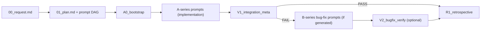
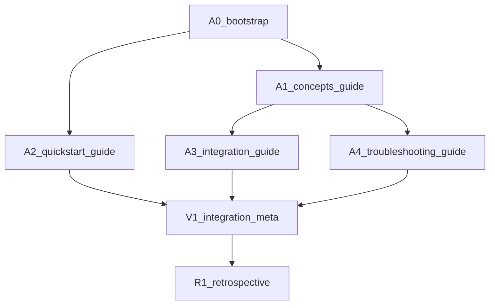

# Workpack Concepts Guide

This guide explains the mental model behind the Workpack Protocol. It is descriptive and onboarding-focused.

For normative rules, use:
- [PROTOCOL_SPEC.md](../workpacks/PROTOCOL_SPEC.md)
- [WORKPACK_META_SCHEMA.json](../workpacks/WORKPACK_META_SCHEMA.json)
- [WORKPACK_STATE_SCHEMA.json](../workpacks/WORKPACK_STATE_SCHEMA.json)
- [WORKPACK_OUTPUT_SCHEMA.json](../workpacks/WORKPACK_OUTPUT_SCHEMA.json)

## What is a Workpack?

A workpack is a versioned unit of work that bundles:
- request intent,
- execution plan,
- prompt-level tasks,
- runtime status,
- machine-readable handoff outputs.

Think of it as a small execution system in your repository: humans read markdown, tools read JSON, and both stay in sync.

## Metadata vs State

The protocol intentionally splits planning from runtime.

| File | Nature | Typical writer | Why it exists |
|---|---|---|---|
| `workpack.meta.json` | Mostly stable | planners/scaffold tools | Defines identity, prompt DAG, ownership, delivery mode |
| `workpack.state.json` | Frequently updated | agents/tooling during execution | Tracks live prompt status, blockers, assignments, execution log |

Why this matters:
- Less noisy diffs: stable plan data is not mixed with high-frequency status updates.
- Better tooling: UIs/CI can cache metadata and poll state.
- Clear audits: state log captures execution history without rewriting planning intent.

## Prompt Lifecycle

Most workpacks follow the same high-level flow:
- `A0` bootstrap,
- `A*` implementation prompts,
- `V1` integration gate,
- `R1` retrospective after verification/merge readiness.

## DAG-Based Orchestration

Prompt execution order is declared explicitly with `depends_on`. This turns the prompt set into a DAG (directed acyclic graph), so agents can:
- run independent prompts in parallel,
- block only on required upstream prompts,
- compute the next executable prompts deterministically.

Example DAG (mirrors a common documentation workpack shape):

In this example:
- `A1` and `A2` can run in parallel after `A0`.
- `A3` and `A4` can run in parallel after `A1`.
- `V1` waits until `A2`, `A3`, and `A4` are all complete.

## Commit Tracking

Workpack outputs connect prompt execution to real Git history:
- `artifacts.commit_shas` in each `outputs/<PROMPT>.json` lists commits for that prompt.
- `change_details` records per-file actions (`created`, `modified`, `deleted`, `renamed`).
- V-series gates verify SHAs exist on the work branch and that declared file changes match commit diffs.

This gives traceability from:
`prompt -> output JSON -> commit SHA -> changed files`.

## Integration Gates (V1)

`V1_integration_meta` is the quality gate before merge readiness. It typically checks:
- upstream prompt outputs exist and are schema-valid,
- acceptance criteria coverage,
- commit tracking integrity (`commit_shas`, branch presence, declared file-change consistency),
- branch/repo status constraints required by your delivery mode.

If checks fail, V1 should report clear blockers and may trigger B-series bug-fix prompts.

## Workpack Groups

A workpack can be part of a larger multi-workpack initiative via `group.meta.json`.

At group level, `group.meta.json` defines:
- participating workpacks,
- phase ordering and parallel/serial execution modes,
- cross-workpack dependency edges.

This allows coordinated rollout across related workpacks while keeping each child workpack independently trackable.

## Key Files Reference

| File | Purpose |
|---|---|
| `00_request.md` | Human request, scope, constraints, and acceptance criteria |
| `01_plan.md` | Human plan and DAG rationale |
| `workpack.meta.json` | Machine-readable static metadata and prompt index |
| `workpack.state.json` | Machine-readable runtime state and execution log |
| `prompts/*.md` | Executable prompt contracts (with `depends_on`/`repos`) |
| `outputs/*.json` | Structured per-prompt handoff artifacts |
| `99_status.md` | Human status dashboard for progress and outputs |
| `group.meta.json` | Optional multi-workpack coordination metadata |
| `workpacks/PROTOCOL_SPEC.md` | Normative protocol specification |
| `workpacks/WORKPACK_*_SCHEMA.json` | Normative schema contracts for meta/state/output |
| `workpacks/_template/` | Canonical starter layout for new workpacks |

## Related Guides

- [QUICKSTART.md](./QUICKSTART.md)
- [INTEGRATION.md](./INTEGRATION.md)
- [TROUBLESHOOTING.md](./TROUBLESHOOTING.md)
