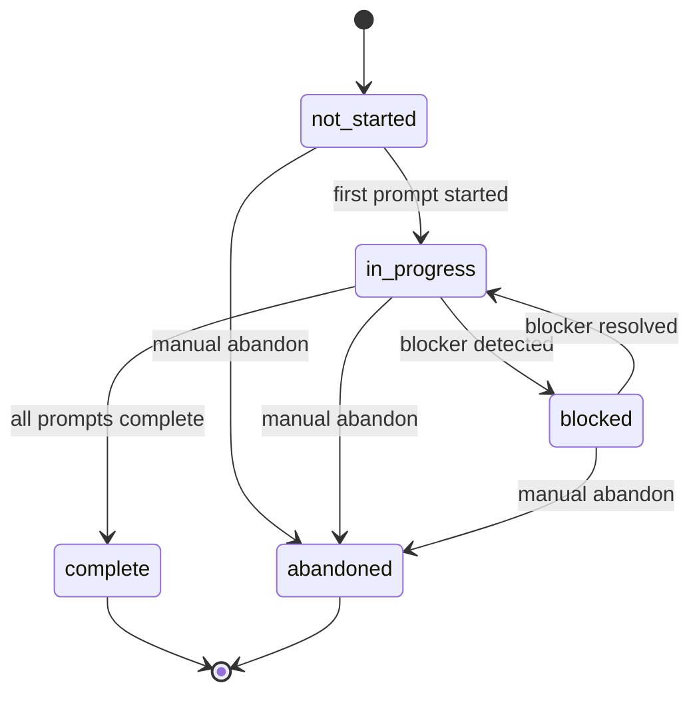
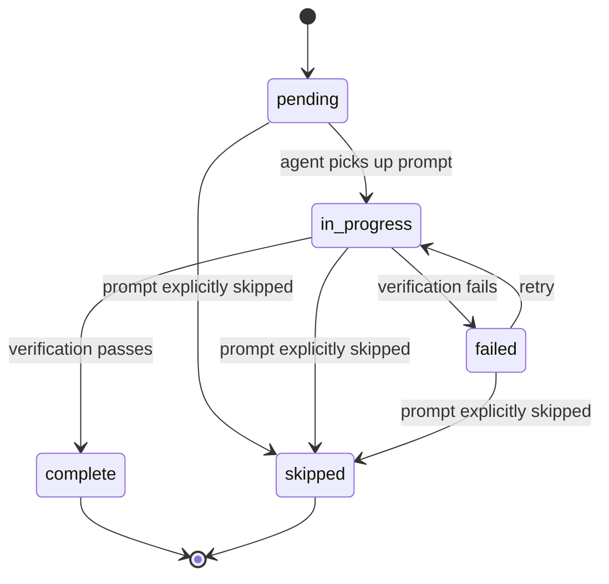
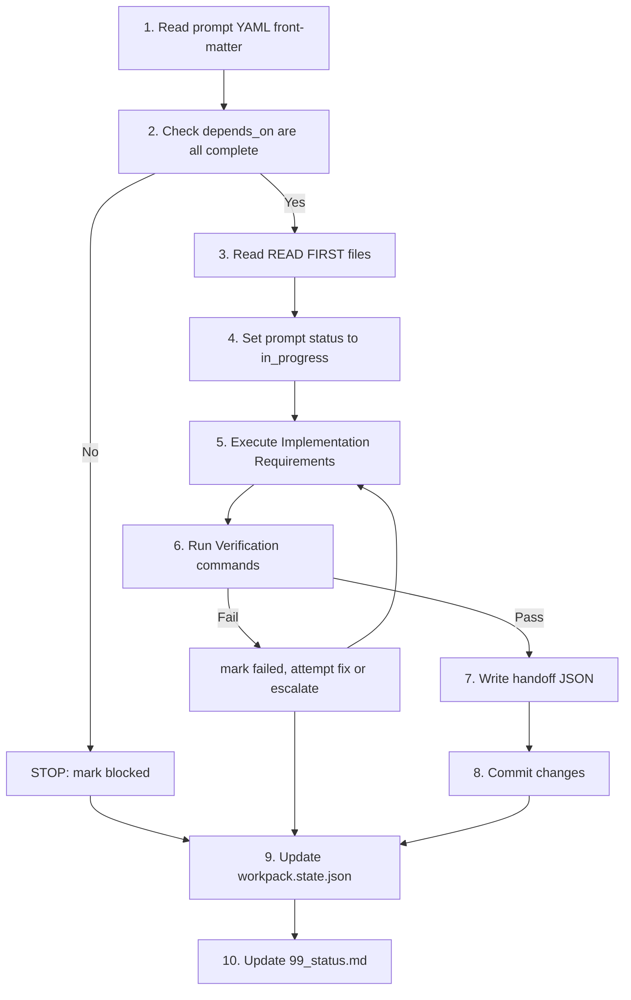

# AGENT_STATE_MACHINE

## 1. Workpack-Level State Diagram

```mermaid
stateDiagram-v2
    [*] --> not_started
    not_started --> in_progress: first prompt started
    in_progress --> blocked: blocker detected
    blocked --> in_progress: blocker resolved
    in_progress --> complete: all prompts complete
    not_started --> abandoned: manual abandon
    in_progress --> abandoned: manual abandon
    blocked --> abandoned: manual abandon
    complete --> [*]
    abandoned --> [*]
```

## 2. Prompt-Level State Diagram

```mermaid
stateDiagram-v2
    [*] --> pending
    pending --> in_progress: agent picks up prompt
    pending --> skipped: prompt explicitly skipped
    in_progress --> complete: verification passes
    in_progress --> failed: verification fails
    in_progress --> skipped: prompt explicitly skipped
    failed --> in_progress: retry
    failed --> skipped: prompt explicitly skipped
    complete --> [*]
    skipped --> [*]
```

## 3. Agent Decision Tree

```mermaid
flowchart TD
    S1["1. Read prompt YAML front-matter"] --> S2["2. Check depends_on are all complete"]
    S2 -->|No| B1["STOP: mark blocked"]
    B1 --> S9["9. Update workpack.state.json"]
    S9 --> S10["10. Update 99_status.md"]

    S2 -->|Yes| S3["3. Read READ FIRST files"]
    S3 --> S4["4. Set prompt status to in_progress"]
    S4 --> S5["5. Execute Implementation Requirements"]
    S5 --> S6["6. Run Verification commands"]
    S6 -->|Fail| B2["mark failed, attempt fix or escalate"]
    B2 --> S5
    B2 --> S9

    S6 -->|Pass| S7["7. Write handoff JSON"]
    S7 --> S8["8. Commit changes"]
    S8 --> S9
```
