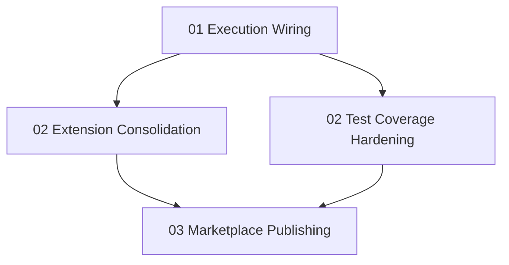

# WorkpackManager v2 — Execution, Quality & Distribution

## Purpose

Second-phase development for the WorkpackManager VS Code extension and reusable workpack protocol. This group picks up where the `workpack-manager` group left off and addresses the remaining gaps identified in project analysis:

1. **Execution wiring** — the `ExecutionOrchestrator` exists but isn't connected to UI commands
2. **Code consolidation** — shared utility extraction, scaffold cleanup, branch hygiene
3. **Test hardening** — increase coverage for under-tested modules (state, parser, views)
4. **Marketplace publishing** — make the extension and protocol distributable

## Dependency Graph

## Phase Plan

| Phase | Mode | Workpacks | Description |
|-------|------|-----------|-------------|
| 1 | serial | `01_execution-wiring` | Wire orchestrator to UI, make extension functional |
| 2 | parallel | `02_extension-consolidation`, `02_test-coverage-hardening` | Refactor + quality uplift |
| 3 | serial | `03_marketplace-publishing` | VSIX + npm + CI/CD |

## Prerequisites

All workpacks in the `workpack-manager` group (phases 1–4) should be at `complete` or `review` status before starting this group. The core architecture, agent integration, and UX layers are the foundation.
